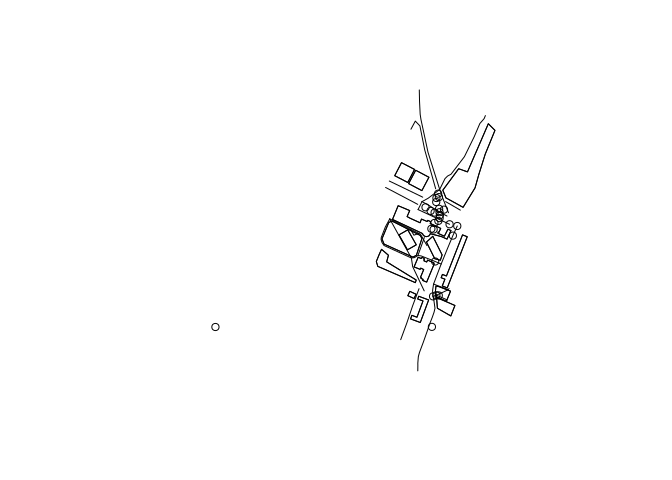

<!-- README.md is generated from README.Rmd. Please edit that file -->

# rosmium

<!-- badges: start -->

[](https://github.com/mpadge/rosmium/actions/workflows/R-CMD-check.yaml)
[](https://codecov.io/gh/mpadge/rosmium)
[](https://www.repostatus.org/#wip)
<!-- badges: end -->

R bindings for [`osmium-tool`](https://osmcode.org/osmium-tool/), a
command-line tool for working with OpenStreetMap data built on the
[`libosmium`](https://osmcode.org/libosmium/) library. Rather than
shelling out to an external `osmium` binary, rosmium embeds
`osmium-tool`’s own C++ command implementations directly in the package
(via `Rcpp`), so there is nothing to separately install: everything
rosmium needs is either a system library it detects at install time
(bz2, zlib, expat) or vendored source bundled with the package itself
(`libosmium`, `protozero`, `nlohmann-json`).

## Installation

You can install the development version of rosmium from
[GitHub](https://github.com/) with:

``` r
# install.packages("remotes")
remotes::install_github("mpadge/rosmium")
```

Then load for use:

``` r
library(rosmium)
```

## Example

Grab a small real-world extract to work with – the “ITS Leeds” test file
also used by [`osmextract`](https://docs.ropensci.org/osmextract/):

``` r
its_example <- osmextract::oe_match("ITS Leeds", quiet = TRUE)

f <- osmextract::oe_download(
  file_url = its_example$url,
  file_size = its_example$file_size,
  provider = "test",
  download_directory = tempdir(),
  quiet = TRUE
)
```

`osmium_fileinfo()` reports header and content summary information,
mirroring `osmium fileinfo --extended`:

``` r
info <- osmium_fileinfo(f, extended = TRUE)
info$data$count
#> $changesets
#> [1] 0
#> 
#> $nodes
#> [1] 1678
#> 
#> $ways
#> [1] 294
#> 
#> $relations
#> [1] 14
```

`osmium_extract()` trims a file down to a geographic boundary – given as
a bounding box here (`c(left, bottom, right, top)`), or alternatively a
`.poly`/GeoJSON polygon file via `polygon`. The default
`strategy = "complete_ways"` keeps every way with at least one node in
the box, pulling in its remaining nodes even if they fall outside it –
which is why the extract’s own bounding box below ends up slightly
larger than the box requested:

``` r
leeds_centre <- tempfile(fileext = ".osm.pbf")
osmium_extract(f, leeds_centre, bbox = c(-1.57, 53.803, -1.56, 53.809))

osmium_fileinfo(leeds_centre, extended = TRUE)$data$count
#> $changesets
#> [1] 0
#> 
#> $nodes
#> [1] 237
#> 
#> $ways
#> [1] 34
#> 
#> $relations
#> [1] 5
osmium_fileinfo(leeds_centre, extended = TRUE)$data$bbox
#> [1] -1.568766 53.804705 -1.558123 53.811020
```

`osmium_tags_filter()` extracts objects matching a tag expression –
here, every way tagged `highway=*`, plus the nodes and relations they
reference:

``` r
highways <- tempfile(fileext = ".osm.pbf")
osmium_tags_filter(f, highways, expressions = "w/highway")

osmium_fileinfo(highways, extended = TRUE)$data$count
#> $changesets
#> [1] 0
#> 
#> $nodes
#> [1] 626
#> 
#> $ways
#> [1] 184
#> 
#> $relations
#> [1] 0
```

`osmium_export()` converts OSM data into geometry-bearing GeoJSON
features, ready to read with a package like
[`sf`](https://r-spatial.github.io/sf/). Here on the bbox-trimmed
extract from above:

``` r
geojson <- osmium_export(leeds_centre, output_format = "geojson")
roads <- sf::st_read(geojson, quiet = TRUE)
plot(sf::st_geometry(roads))
```



## Available commands

Each `osmium-tool` command vendored into rosmium has a corresponding
`osmium_*()` R function:

| Function | Wraps | Purpose |
|----|----|----|
| `osmium_cat()` | `osmium cat` | Concatenate OSM files and convert between formats |
| `osmium_export()` | `osmium export` | Export to GeoJSON, geopackage-friendly text, or PostgreSQL COPY format |
| `osmium_extract()` | `osmium extract` | Create a geographic extract (bbox, polygon, or config-file-defined) |
| `osmium_fileinfo()` | `osmium fileinfo` | Show header/content information about an OSM file |
| `osmium_getid()` | `osmium getid` | Get objects with given IDs (optionally with referenced objects) |
| `osmium_merge()` | `osmium merge` | Merge several sorted OSM files into one |
| `osmium_sort()` | `osmium sort` | Sort OSM data files by type then ID |
| `osmium_tags_filter()` | `osmium tags-filter` | Keep (or drop) objects matching tag expressions |

See each function’s documentation (e.g. `?osmium_extract`) for its full
set of options.

## License

GPL-3, inherited from the GPL-3-licensed `osmium-tool`/`libosmium` C++
sources rosmium wraps and vendors (see `LICENSE.txt`).
